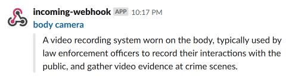

# Wiktionary WOTD to Slack

A little Ruby script that posts the Wiktionary [Word of the Day](https://en.wiktionary.org/w/index.php?title=Wiktionary:Word_of_the_day) to a Slack room.

It uses Wiktionary’s [RSS feed](https://en.wiktionary.org/w/api.php?action=featuredfeed&feed=wotd) to extract the most recent entry, wraps the WOTD and its definition in a nicely formatted Slack message and posts it to the Slack room.

## Install

1/ It needs the [Sanitize](https://rubygems.org/gems/sanitize) Ruby gem to remove the Wikitionary HTML so install that first.

    gem install sanitize

2/ Create a [Slack webhook](https://api.slack.com/incoming-webhooks#posting_with_webhooks) and provide it to the script with the `hook` flag.

Run `./wotd` from the download directory (or throw it anywhere in your `PATH`) and the most recent WOTD should show up in the selected Slack channel.

    ./wotd --hook https://hooks.slack.com/services/some/code/here

You can optionally run this as a crontab to be greeted by a new WOTD in Slack every day.

## Why

Idea from my copywriter colleague who thought it would be fun to try to use a random WOTD in our discussions in a Slack thread where we were throwing randomly complex words at each other.
